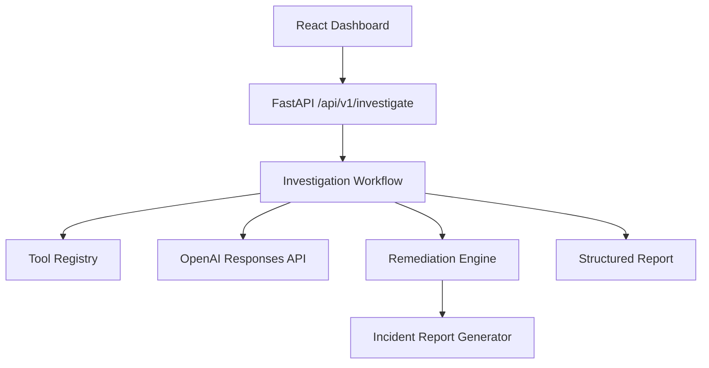

# OpsPilot AI


OpsPilot AI is an autonomous Kubernetes incident investigation platform powered by OpenAI.

It combines a production-style React dashboard, a FastAPI investigation backend, a tool-based agent workflow, remediation recommendations, structured incident reporting, and infrastructure packaging for Docker, Helm, Terraform, and GitHub Actions.

## Project Overview

OpsPilot AI investigates Kubernetes incidents, gathers evidence, explains the likely root cause, recommends safe remediation, and generates an internal incident report.

The MVP keeps remediation advisory-only. No Kubernetes action is executed without human approval.

## Architecture Diagram



See also:

- [Architecture Notes](docs/architecture.md)
- [Deployment Guide](docs/deployment.md)
- [Demo Guide](docs/demo.md)

## Features

- Autonomous Kubernetes incident investigation
- Structured AI evidence and reasoning
- Safe remediation recommendations
- Incident reporting
- Modern enterprise-style dashboard
- Dockerized local deployment
- Helm chart deployment
- Terraform bootstrap layer
- GitHub Actions CI pipeline

## AI Workflow

1. Receive the incident.
2. Select relevant tools.
3. Collect Kubernetes evidence.
4. Build the OpenAI prompt.
5. Call the OpenAI Responses API.
6. Generate remediation recommendations.
7. Generate an incident report.

## Technology Stack

- Frontend: React, TypeScript, Vite, TailwindCSS
- Backend: FastAPI, Python 3.12
- AI: OpenAI Responses API
- Tools: Mock Kubernetes tool framework
- Reporting: Pydantic-based report generator
- Containers: Docker, Docker Compose
- Orchestration: Helm, Kubernetes
- Infrastructure: Terraform
- CI/CD: GitHub Actions

## Repository Structure

```text
backend/        FastAPI service, workflows, tools, reports
frontend/       React dashboard
docs/           Architecture, deployment, and demo notes
helm/           Helm chart for cluster deployment
terraform/      Terraform bootstrap and Helm release
.github/        GitHub Actions workflows
docker-compose.yml
README.md
LICENSE
```

## Local Setup

### Backend

```bash
cd backend
copy .env.example .env
uv sync
uv run uvicorn app.main:app --reload
```

### Frontend

```bash
cd frontend
copy .env.example .env
npm install
npm run dev
```

## Environment Variables

### Backend

- `OPENAI_API_KEY`
- `OPENAI_MODEL`

### Frontend

- `VITE_API_BASE_URL`

### Terraform

- `openai_api_key`
- `openai_model`
- `ingress_host`
- `backend_image`
- `frontend_image`
- `backend_tag`
- `frontend_tag`
- `replica_count`

## Docker Deployment

```bash
docker compose build
docker compose up
docker compose down
```

## Helm Deployment

```bash
helm install opspilot ./helm/opspilot
kubectl get pods
kubectl get svc
```

## Terraform Deployment

```bash
cd terraform
terraform init
terraform plan -var-file=terraform.tfvars
terraform apply -var-file=terraform.tfvars
```

## API Documentation

- FastAPI docs: `/docs`
- Investigation endpoint: `POST /api/v1/investigate`

Example payload:

```json
{
  "incident": "CrashLoopBackOff"
}
```

## Screenshots

Add screenshots here in future revisions:

- Dashboard landing page
- Investigation in progress
- Investigation results
- Remediation recommendations
- Incident report view

## Future Roadmap

- Kubernetes execution approval flow
- Persistent incident history
- Exportable Markdown, HTML, and PDF reports
- Multi-cluster support
- Live status indicators
- Expanded enterprise tool integrations
