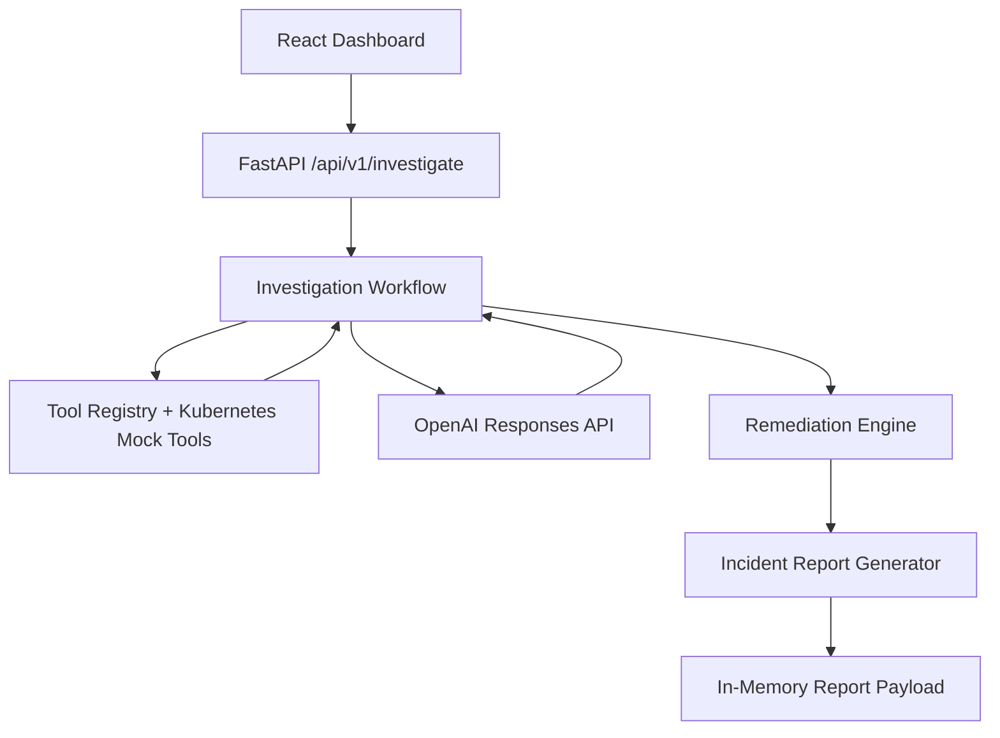

# OpsPilot AI Architecture

OpsPilot AI is an autonomous Kubernetes incident investigation platform built around a clean backend orchestration stack and a modern operator-facing React dashboard.

## Architecture Summary

- **Frontend**: React + TypeScript dashboard for incident input, progress visibility, and incident output.
- **Backend**: FastAPI service that exposes the investigation endpoint and coordinates the workflow.
- **OpenAI**: Responses API used for reasoning and structured incident analysis.
- **Tools**: Mock Kubernetes tools provide evidence during the MVP phase.
- **Agent Workflow**: Selects tools, gathers evidence, builds prompts, invokes OpenAI, generates remediation, and produces a report.
- **Reporting**: Structured incident reports are built in memory after remediation recommendations are produced.
- **Packaging**: Docker, Helm, and Terraform support local and cluster deployment.

## Flow

1. The user submits a Kubernetes incident.
2. The backend validates the request.
3. The investigation workflow selects tools and gathers evidence.
4. The OpenAI service returns a structured investigation response.
5. The remediation engine creates advisory remediation actions.
6. The report generator creates an in-memory incident report.
7. The API returns the existing investigation response contract.

## High-Level Diagram

## Design Principles

- Keep the API contract stable.
- Keep remediation advisory-only until execution approval is introduced.
- Keep report generation backend-only and in-memory.
- Keep deployment layers separated from application logic.
- Prefer configuration-driven behavior over hardcoded values.
